# Micro-Drama Interactive Player

A vertical, swipeable feed of short looping micro-drama episodes, built in Flutter:

- Full-screen Google Ad Manager **test** ads sit between episodes.
- Episode 7 sits behind a paywall that the feed physically cannot scroll past.
- You can double-tap to like, scrub with a horizontal drag anywhere on the video, and unlock with an animated purchase.

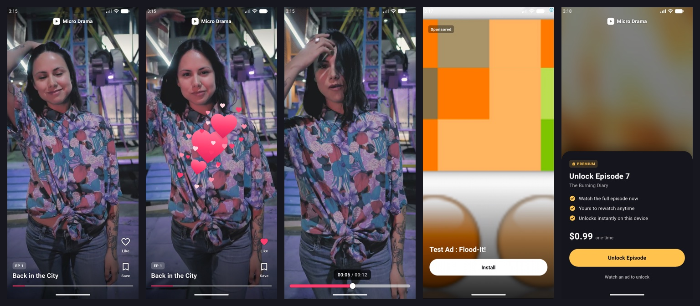

Android and iOS only, because Google Mobile Ads doesn't support desktop or web.

## Contents

- [Demo](#demo)
- [Run it](#run-it)
- [Architecture](#architecture)
- [Feed composition](#feed-composition)
- [Key decisions](#key-decisions)
- [Ads: preloading and no-fill](#ads-preloading-and-no-fill)
- [Paywall and lock physics](#paywall-and-lock-physics)
- [Gestures](#gestures)
- [Motion and accessibility](#motion-and-accessibility)
- [Performance](#performance)
- [Debug panel](#debug-panel)
- [Analytics](#analytics)
- [Tests and CI](#tests-and-ci)
- [What I'd do next](#what-id-do-next)
- [Media credits](#media-credits)

## Demo

These clips were recorded on the Android emulator in debug mode, so they run at a lower frame rate than the app does in profile or release builds on a phone.

| Double-tap and combo | Scrub | Paywall and unlock | Ad no-fill skip |
|:---:|:---:|:---:|:---:|
| 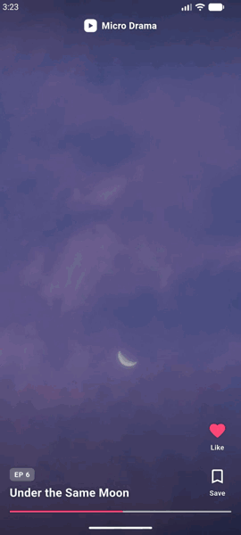 | 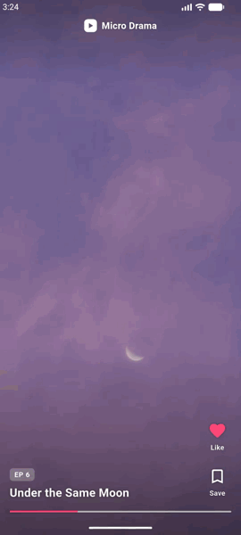 | 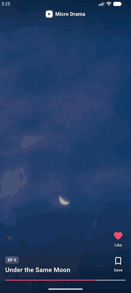 | 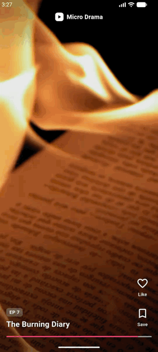 |
| [hearts.gif](docs/demo/hearts.gif) | [scrub.gif](docs/demo/scrub.gif) | [paywall.gif](docs/demo/paywall.gif) | [nofill.gif](docs/demo/nofill.gif) |

<details>
<summary>Screenshots</summary>

| Feed | Double tap | Scrub |
|:---:|:---:|:---:|
| 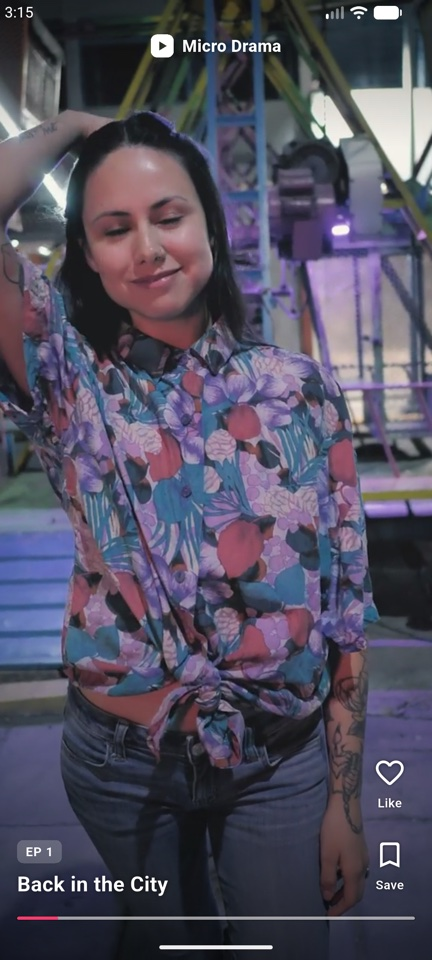 | 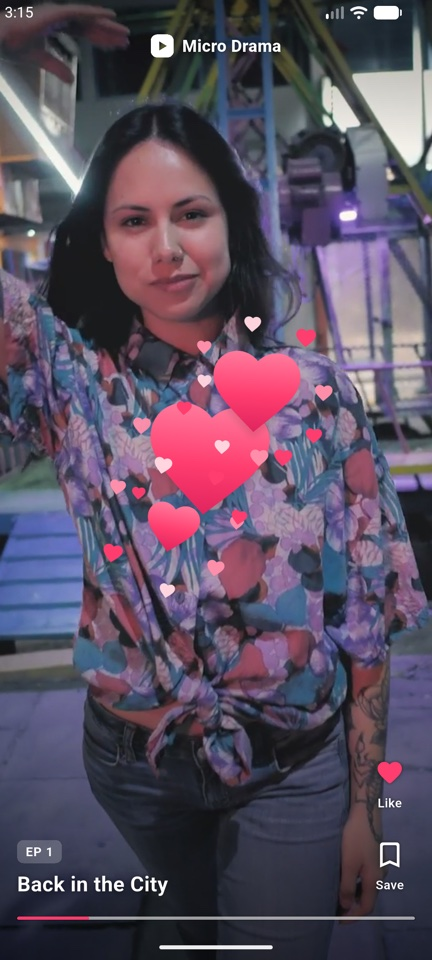 | 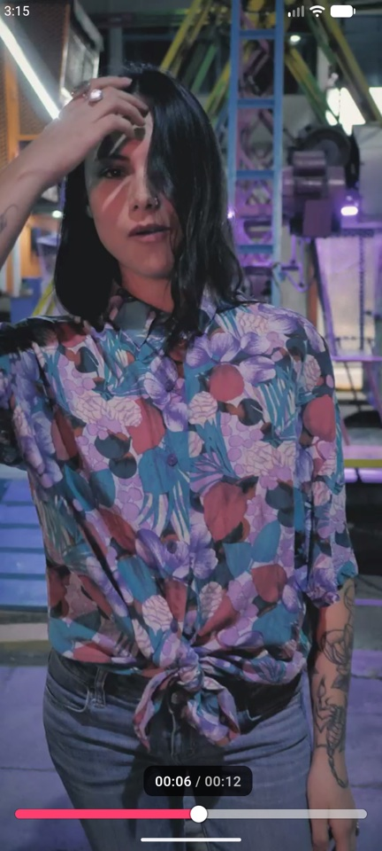 |
| **Native test ad** | **Paywall on E7** | **Purchasing** |
| 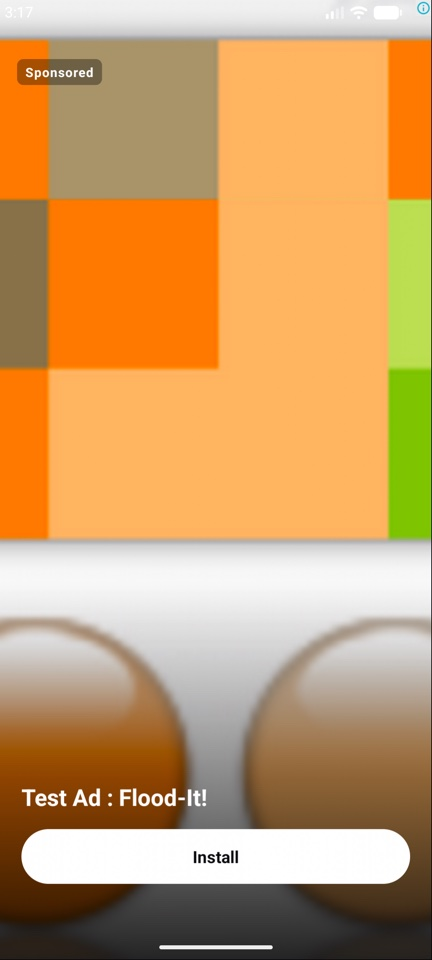 | 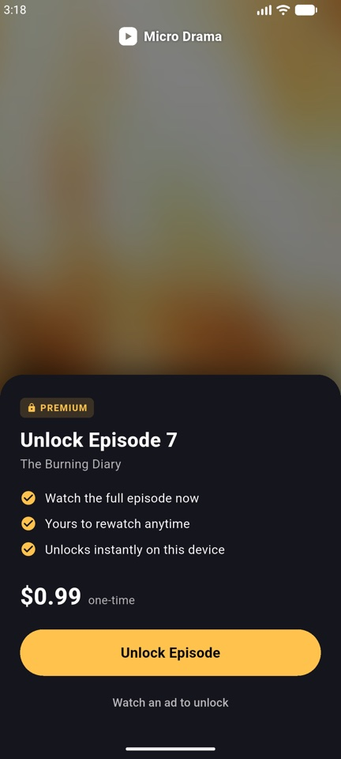 | 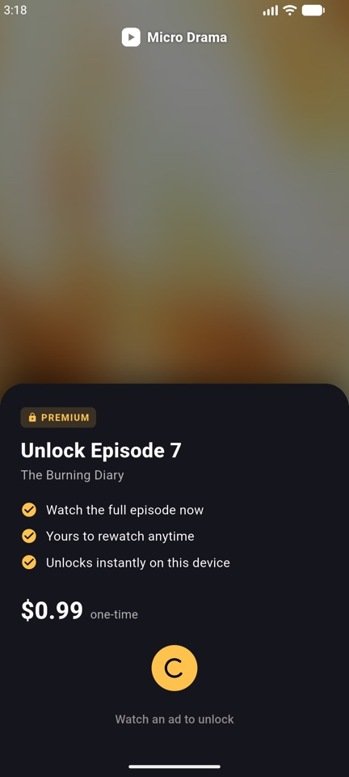 |
| **Unlocked** | **Debug panel** | **Loading skeleton (slow network)** |
| 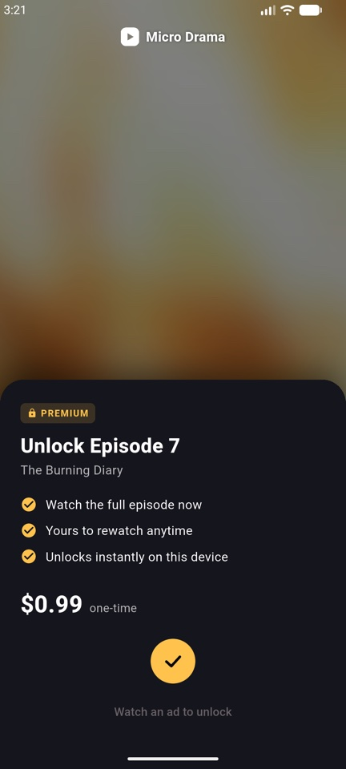 | 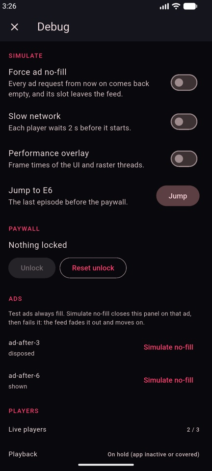 | 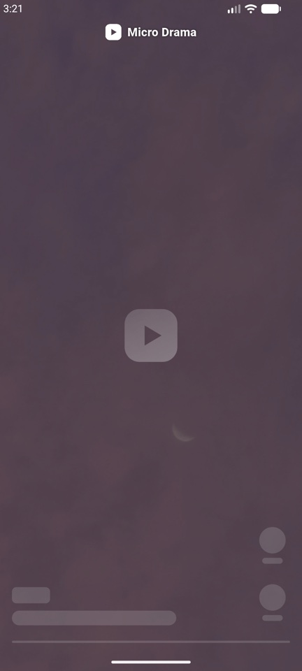 |

</details>

## Run it

Requires Flutter 3.47.4 (stable channel, Dart 3.13).

```sh
flutter pub get
flutter run                 # a phone or emulator
flutter test                # unit and widget tests
flutter analyze
```

- **Ads:** they need no setup. Every unit id is one of Google's Ad Manager demo units, which only ever serve test ads ([ad_config.dart](lib/core/env/ad_config.dart)).
- **Episodes:** they stream from Mixkit, so the device needs network access the first time. After that, cached episodes play from disk.
- **Debug panel:** in debug and profile builds, long-press the **Micro Drama** logo at the top of the feed. Release builds include it only when built with `--dart-define=DEBUG_PANEL=true`:

  ```sh
  flutter build apk --release --dart-define=DEBUG_PANEL=true
  ```
- **Performance suites:** these run on a real device in profile mode. The commands are in [PERFORMANCE.md](PERFORMANCE.md), for example:

  ```sh
  flutter drive --profile --no-dds --driver=test_driver/integration_test.dart \
    --target=integration_test/perf_test.dart -d <device-id>
  ```

## Architecture

Code is in five layers. The UI never talks to a repository or an SDK. It reads Riverpod notifiers through `select()`, and calls their methods.

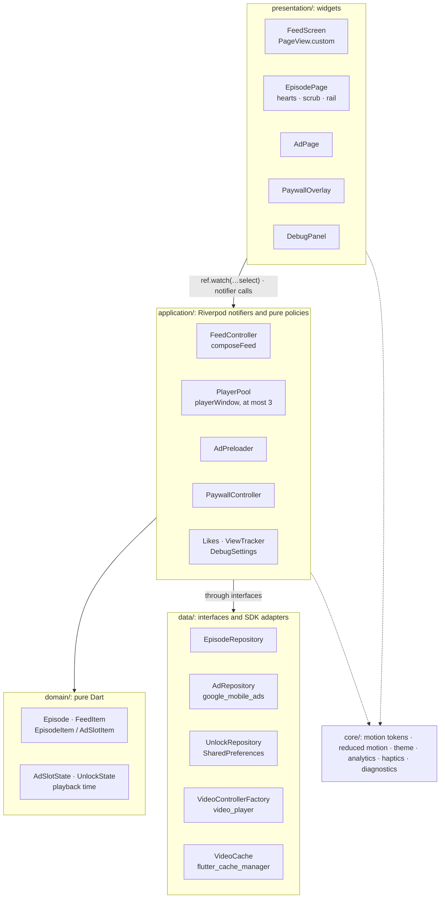

```
lib/
  core/          motion/motion_tokens.dart (every spring, curve and duration), reduced_motion.dart,
                 theme, analytics, haptics, imaging (box blur), diagnostics (lifecycle log)
  domain/        Episode, FeedItem (sealed), AdSlotState, UnlockState, playback time formatting
  data/          repositories and SDK adapters, each behind an interface the tests fake
  application/   FeedController, PlayerPool, AdPreloader, PaywallController, likes and saves,
                 ViewTracker, DebugSettings, plus pure policies: composeFeed, playerWindow
  presentation/  feed/, player/, gestures/, paywall/, ads/, debug/, shared/
```

The application layer owns every side effect. Here are the two rules that matter most and where they live:

- **At most three video players:** the current page and its two neighbours. `playerWindow` (pure and unit-tested) decides which episodes get one. `PlayerPool` creates and disposes them, and nothing else does.
- **E7 never gets a player while it is locked:** three checks enforce this. `playerWindow` leaves it out. `PlayerPool` checks `canPrepare` again just before it constructs a controller. And a test with a counting fake factory proves no controller is ever made. The rule relaxes only once the user taps Unlock (see below).

## Feed composition

`composeFeed` turns the catalog into the page list. An ad break follows every third episode, as long as the episode after it is at most E7. The feed never ends on an ad.

```
E1  E2  E3  AD  E4  E5  E6  AD  E7🔒  E8  E9  E10
```

- **Stable ids.** Ids come from content (`ep-07`, `ad-after-3`), not position, so a page keeps its id however the list changes.
- **Pages are matched by id.** The pager is a `PageView.custom` with a `SliverChildBuilderDelegate` whose `findChildIndexCallback` maps `ValueKey(item.id)` back to an index. When an ad leaves the feed, every remaining page keeps its element, state and player instead of being rebuilt one index over.
- **One repaint boundary per page.** Each page is wrapped in a `RepaintBoundary`.
- **The page delegate is cached.** It's built once per item list, so a physics swap (for example, when a scrub starts) doesn't rebuild the cached pages.
- **The paywall lock follows the id.** The lock position is recomputed from E7's id on every build, because removing an ad shifts E7's index.

## Key decisions

| Decision | Why | Trade-off |
|---|---|---|
| Riverpod notifiers, read through `select()` | Each widget rebuilds only for the slice it shows. During playback nothing rebuilds at all. | More small providers and selectors to keep track of. |
| A pool of at most 3 controllers (current, next, previous) | Bounded memory and decoders. The next page is already initialized and parked on its first frame, so swipes start instantly. | Jumping more than one page can show a brief skeleton. |
| Items addressed by id, never index | Removing an ad (no-fill) can't shift state, players or the lock onto the wrong page. | Lookups go through an id→index map that has to be rebuilt per list. |
| Custom `PaywallLockPhysics` with `pageSnapping: false` | `PageView` wraps its physics in `PageScrollPhysics`, whose flings never consult the parent. Snapping inside our own physics lets a fling settle exactly on E7. | We re-implement page snapping, which is covered by physics tests. |
| Native ads with a full-screen factory, rather than interstitials | They feel like a page of the feed, are swipeable, and can be preloaded and released per slot. | A native layout to maintain on each platform (`NativeAdFactory.kt` and `.swift`). |
| A no-fill removes the slot | No dead pages. If the user is on the failing slot, it fades out and the feed moves on by itself. | The feed list changes under the user, which is why everything is keyed by id. |
| Hearts as sprites drawn by one `CustomPainter` | No widget per heart, and a ticker runs only while hearts are on screen. Each sprite is one textured quad, where a live shadow cost a blur pass per heart. | Sprites are rasterized once per device pixel ratio. |
| The paywall backdrop is the poster blurred once on an isolate | A full-screen `BackdropFilter` re-blurred the screen every frame: the paywall's main GPU cost (p99 26.6 → 9.7 ms). | The blur fades in rather than growing from sigma 0. |
| Our own tap detector, timed with pointer timestamps | Exact 280 ms and 40 px double-tap rules that frame jank can't stretch, plus unlimited combos. Swipes and rail buttons still win in the gesture arena. | More code than `onDoubleTap`, covered by `TapSequence` unit tests. |
| Videos cached with `flutter_cache_manager` | An episode already on disk starts from the file. Streamed ones are warmed into the cache in the background. | Whole-file caching, not segments (see [What I'd do next](#what-id-do-next)). |
| All motion values in [`motion_tokens.dart`](lib/core/motion/motion_tokens.dart) | One place to tune the feel, so springs and durations stay consistent. | Every new animation adds a token there. |

## Ads: preloading and no-fill

Each slot moves through **idle → loading → loaded → shown → disposed**, or ends at **failed** ([ad_preloader.dart](lib/application/ad_preloader.dart)):

- **Preload.** A slot starts loading once it is at most 3 pages ahead of the user, or right behind them. The first slot loads at launch, and the second from E4, so both are ready when the user arrives.
- **Timeout.** A load fails after 8 s. The SDK's one-time start-up doesn't count against that budget. An ad that turns up after its timeout is released unseen.
- **Shown, then released.** A loaded ad counts as shown once its page is on screen. It is released once the user is 2 pages away and is never shown again: coming back loads a fresh one.
- **No-fill.** A no-fill, error, timeout, or debug-forced failure fails the slot, and the feed drops it. What the user sees depends on where they are:

  | The failing slot is… | What happens |
  |---|---|
  | ahead of the user | Recomposed away. The user never knows it was there. |
  | behind the user | Removed, and the pager jumps one index back in the same frame, so the screen doesn't move. |
  | on screen | The ad fades out (180 ms), the feed animates to the next page (360 ms), then the slot is dropped. Under reduced motion the next page replaces it in place. |

  If the user's finger is on the feed, the removal waits for the scroll to end.

- **Placeholder.** While a slot loads, its page shows the branded skeleton with a Sponsored tag. The feed logo steps aside on ad pages, so the advertiser's creative, Sponsored badge and AdChoices icon stay clear.

## Paywall and lock physics

[`PaywallLockPhysics`](lib/presentation/feed/paywall_lock_physics.dart) stops the feed at the first locked page:

- **Drag.** Moving forward past E7 is turned into overscroll in `applyBoundaryConditions`, so a drag can't pull past it.
- **Fling.** `createBallisticSimulation` pages as if the feed ended at E7. A fling towards it settles exactly on it, and a forward fling from it goes nowhere.
- **Backwards.** Scrolling back is unchanged, and the snap spring comes from the parent physics.

The unlock goes **locked → unlocking → unlocked** ([paywall_controller.dart](lib/application/paywall_controller.dart)):

1. **The tap.** The button collapses into a spinner. The episode becomes *unlocking*. From this point its player may be created and initialized, but it stays paused and silent.
2. **The purchase is saved.** It's simulated with 800 ms of latency and saved with `SharedPreferences`. The spinner turns into a check, with a success haptic.
3. **The exit.** The card slides away. Only once the exit has finished does the episode count as *unlocked*: the lock lifts, and the already-warm player starts with no loading gap.

If the purchase fails, the episode locks again, its prepared player is released, and the card shows an error. The card enters with a spring and staggered content. The Unlock button shimmers on a cycle and squashes when pressed.

## Gestures

- **Double tap to like** ([heart_burst_layer.dart](lib/presentation/gestures/heart_burst_layer.dart)):
  - **Detection.** [`TapSequence`](lib/presentation/gestures/tap_sequence.dart) reads taps from the platform's pointer timestamps. A second tap within 280 ms and 40 px is a double tap, and every tap within 280 ms of the last adds a heart, so combos stack. A single tap plays or pauses once the window passes with no second tap.
  - **Hearts.** Each heart appears where the finger landed. It pops 0 → 1.2 → 1.0 on an underdamped spring with a random tilt of ±15°, then drifts up 60 px and fades over 500 ms. Six to eight sparks burst outwards.
  - **Like state.** The rail's like button springs on and stays filled. The like lives in a provider, not in the widget. A light haptic confirms it.
- **Scrub** ([scrub_bar.dart](lib/presentation/gestures/scrub_bar.dart)): a horizontal drag anywhere on an episode scrubs it.
  - **While scrubbing.** The feed stops paging and the video pauses. The bar springs from 3 to 10 px, and the episode chrome and the logo fade out.
  - **Time bubble.** A bubble reading "00:05 / 00:15" follows the finger, kept 16 px clear of the screen edges.
  - **Seeking.** Seeks go out at most every 80 ms, then exactly where the finger lifts, and playback continues from there. Each end of the video gives a haptic tick.
  - **Painting.** The track is one `CustomPainter` repainted by the controller and the scrub state, behind a `RepaintBoundary`, so playback rebuilds no widgets.
  - **Where it's off.** Scrubbing isn't available on ad pages or on locked E7.

## Motion and accessibility

- **Reduced motion.** The app reads one flag, `MediaQuery.disableAnimations`.
  - Flutter sets it for Android's *Remove animations*. iOS reports *Reduce Motion* separately, so [`ReducedMotionScope`](lib/core/motion/reduced_motion.dart) folds it into the same flag at the app root.
  - With the flag set, springs become short fades:
    - **Hearts:** they appear in place and fade, with no pop, tilt, drift or sparks.
    - **Rail icons:** they crossfade.
    - **Paywall card:** it fades instead of sliding.
    - **Scrub bar and bubble:** the bar opens with a short tween instead of a spring, and the bubble fades in without scaling.
    - **Play/pause glyph:** it fades at full size.
    - **No-fill skip:** it jumps instead of scrolling.
    - **Shimmers:** they stop.
  - These fades keep their length even under Android's *Remove animations*. Otherwise Flutter would run their controllers at 5% speed and the fades would last a single frame.
- **Screen readers:**
  - **Like and Save** are toggle buttons with their own tap actions.
  - **The scrub track** is a slider that reads "00:05 of 00:15", and increase and decrease move it by 5 s.
  - **Unlock** reads "Unlock episode 7, The Burning Diary, for $0.99".
  - **The logo's** long press is exposed as "open developer options" in debug and profile builds.
  - **The paywall backdrop** swallows stray taps without offering a dead tap action.

## Performance

I profiled in profile mode on a OnePlus CPH2569, which has a mid-range Adreno GPU, with Impeller falling back to OpenGL ES. Every interaction is scripted in `integration_test/`. Here are the before and after numbers: before is one warm run, after is the median of five.

| Interaction | Raster p99 (ms) | Frames > 16 ms | Widget rebuilds |
|---|---|---|---|
| Idle playback (5 s) | 6.8 → 6.2 | 0 → 0 | 0 → 0 |
| Swipe (8 swipes) | 9.4 → 10.2 | 0 → 2 | 1066 → 574 |
| Scrub | 23.6 → **16.4** | 4 → 3 | 619 → 311 |
| Double tap and combo | 15.7 → **12.2** | 1 → 1 | 69 → 67 |
| Paywall entrance | 26.6 → **9.7** | 13 → **1** | 437 → 353 |

- **Swipe.** The swipe numbers are within this phone's run-to-run noise.
- **Memory.** It stays flat over three full passes of the feed, and the lifecycle log confirms every player and ad is disposed.
- **Residual.** About one slow frame remains when a scrub starts, while the decoder produces the first seeked frame.

[PERFORMANCE.md](PERFORMANCE.md) has the method, each fix and every run.

## Debug panel

In debug and profile builds, long-press the logo to open the panel ([debug_panel.dart](lib/presentation/debug/debug_panel.dart)). Release builds have it only when built with `--dart-define=DEBUG_PANEL=true`. It offers:

- **Force ad no-fill:** every ad request from then on comes back empty.
- **Slow network:** each player waits 2 s before it initializes, which shows the loading skeleton.
- **Performance overlay:** Flutter's frame-timing overlay.
- **Jump to E6:** the last episode before the paywall.
- **Unlock and Reset unlock:** reset locks E7 again and clears the saved unlock.
- **Per ad slot:**
  - its live state;
  - **Simulate no-fill**, which closes the panel on that ad, then fails it, so you can watch the feed skip it.
- **Live view:** the player pool (live players out of 3, playback state) and every feed item.

## Analytics

`AnalyticsService` is an interface. `ConsoleAnalytics` prints each event, and the tests record them with a fake.

| Event | Fired when | Parameters |
|---|---|---|
| `episode_view` | an episode becomes the page on screen | `episode`, `position`, `locked` |
| `paywall_shown` | a locked episode's paywall comes on screen | `episode` |
| `like` | a like goes on or off | `episode`, `liked`, `source` (`button` or `double_tap`) |
| `scrub` | a scrub ends | `episode`, `from_ms`, `to_ms` |
| `unlock_tap` | the user taps Unlock | `episode` |
| `unlock_success` | the purchase is saved | `episode` |
| `ad_request` | a slot asks for an ad | `slot` |
| `ad_loaded` | an ad arrives | `slot`, `latency_ms` |
| `ad_no_fill` | a slot fails | `slot`, `reason` (`no_fill`, `timeout`, `error_<code>`, `simulated` or `forced`) |
| `ad_impression` | the SDK records an impression | `slot` |

## Tests and CI

- **Suite size and coverage:** 343 tests in 46 files, with 95.8% line coverage. The only lines not covered are the thin adapters that call platform SDKs.
- **Unit tests** cover every pure policy:
  - feed composition, the player window, lock state and the tap sequence;
  - scrub math, the seek throttle and heart physics;
  - the box blur.
- **Application tests** run every notifier against fakes: the pool, preloader, paywall, feed, likes, view tracker and debug settings. Among other things, they check:
  - that the pool never creates a controller for locked E7;
  - that analytics events fire with the right parameters;
  - that the forced no-fill and slow-network switches take effect.
- **Widget tests** drive the real feed with fake players and ads:
  - lock physics against flings;
  - no-fill paths, including the reduced-motion jump;
  - gestures, using a timestamped `Finger` helper;
  - semantics, reduced-motion behaviour and rebuild budgets.
- **Device suites:** `integration_test/` holds the profiling suites behind PERFORMANCE.md.
- **CI:** [`.github/workflows/ci.yml`](.github/workflows/ci.yml) runs on every push to `main` and every pull request. It checks formatting, then runs `flutter analyze` and `flutter test --coverage`, and uploads the coverage report.

## What I'd do next

- **HLS with adaptive bitrate.**
  - Serve each episode as HLS (or DASH) renditions, which `video_player` already plays on both platforms.
  - Start every episode on a low rendition for an instant first frame. Preload only the first segments of the next episode instead of whole files.
  - Cache segments rather than MP4s, for example with ExoPlayer's `CacheDataSource` on Android and `AVAssetDownloadTask` on iOS behind the existing `VideoCache` interface.
- **Scrub thumbnails from sprite sheets.**
  - Generate one sprite sheet per episode on the server, for example a 10×10 grid at one frame a second, with a WebVTT index.
  - Fetch it alongside the episode. The time bubble then shows the frame under the finger: a `drawImageRect` from the cached sheet, so no extra decoding happens while scrubbing.
- **Server-driven ad cadence.**
  - `composeFeed` already takes `adEvery` and `maxAdsBeforeEpisode` as parameters, and the preload and release distances are config.
  - Serve all of these from remote config per market and cohort, with frequency caps and a kill switch.
  - Then let the server send the slot positions directly, so the client composes whatever it's given.
- **A/B testing paywall copy.**
  - Drive the headline, benefit lines, price framing and button label from remote-config variants.
  - Attach the variant to `paywall_shown`, `unlock_tap` and `unlock_success`, so conversion can be compared per variant at each step.
  - Guard the test with a holdout and a minimum sample before rolling a winner out.
- **Also:**
  - real purchases through StoreKit and Play Billing, with server-side receipt validation;
  - "Watch an ad to unlock" through the rewarded demo unit that's already in `AdConfig` (the button currently says it's not available yet);
  - an offline state;
  - crash reporting and a real analytics backend;
  - localization;
  - profiling on a low-end Android device and on iPhones. The iOS project is configured (native ad factory, Ad Manager keys) but I verified this build on Android only.

## Media credits

Episode videos stream from [Mixkit](https://mixkit.co) under the [Mixkit License](https://mixkit.co/license/). The posters in `assets/posters/` are each clip's first frame. The ads are Google's Ad Manager test creatives.
